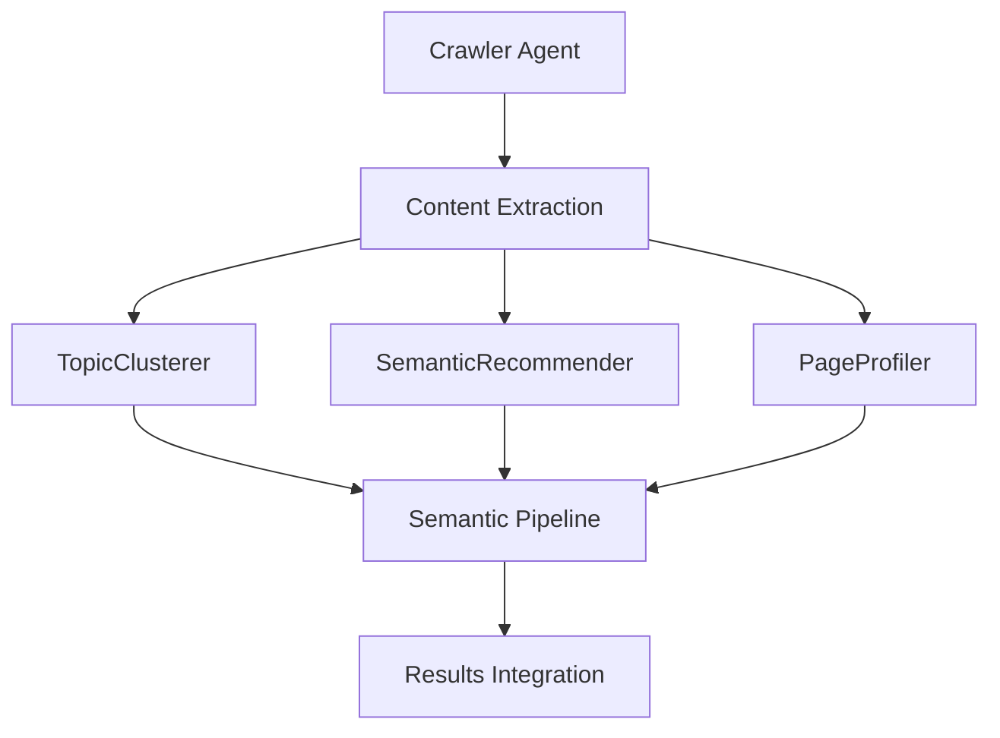

# Sprint 3: IA Sémantique & Agents Avancés

## Vue d'Ensemble
Sprint 3 introduit l'intelligence artificielle sémantique dans Fire Salamander, avec un focus sur l'adaptation du crawler existant et la création d'agents sémantiques avancés.

## Objectifs Critiques

### 1. FIX-01: Adaptation Crawler (PRIORITÉ 1)
**Objectif**: Adapter le crawler existant pour implémenter l'interface `agents.Agent`
- **Localisation**: `internal/agents/crawler/`
- **Action**: ADAPTER (ne pas recréer)
- **Interface cible**: `agents.Agent`
- **Approche**: TDD (Test-Driven Development)

### 2. FIX-02: Corrections Progressions
**Problème**: Pourcentages incorrects (500%, 3000%, 10000%)
- **Localisation**: Système de calcul des progressions
- **Solution**: Réviser les calculs de progression

### 3. Agents Sémantiques Avancés
Création de 3 nouveaux agents sémantiques:

#### TopicClusterer
- **Fonction**: Clustering thématique du contenu
- **Input**: Contenu textuel des pages crawlées
- **Output**: Clusters thématiques et associations

#### SemanticRecommender  
- **Fonction**: Recommandations sémantiques
- **Input**: Analyse de contenu et contexte
- **Output**: Recommandations d'optimisation sémantique

#### PageProfiler
- **Fonction**: Profilage sémantique des pages
- **Input**: Page data complète
- **Output**: Profil sémantique détaillé

## Architecture Technique

### Interfaces d'Agents
```go
type Agent interface {
    Name() string
    Process(ctx context.Context, data interface{}) (*AgentResult, error)
    HealthCheck() error
}
```

### Adaptation Crawler
Le crawler existant doit être adapté pour:
1. Implémenter l'interface `Agent`
2. Maintenir sa fonctionnalité de crawling
3. S'intégrer dans le pipeline sémantique
4. Respecter les patterns configurables

### Pipeline Sémantique


## Spécifications Techniques

### Configuration
- **Principe**: Tout doit être configurable
- **Format**: YAML avec variables d'environnement
- **Validation**: Schemas stricts

### Tests
- **Couverture**: 100% pour nouveaux agents
- **Types**: Unitaires, intégration, E2E
- **TDD**: Tests écrits avant implémentation

### Performance
- **Concurrent**: Support multi-threading
- **Mémoire**: Gestion optimisée
- **Cache**: Stratégies intelligentes

## Rôles de Développement

### Architecte
- Design des interfaces d'agents
- Architecture du pipeline sémantique
- Patterns de configuration

### QA
- Stratégies de test TDD
- Validation des performances
- Contrôle qualité continu

### Dev
- Implémentation des agents
- Adaptation du crawler
- Intégration pipeline

### Reviewer
- Code review systématique
- Validation architecture
- Conformité standards

### Doc
- Documentation technique
- Guides d'utilisation
- Spécifications API

## Critères d'Acceptation

### FIX-01: Crawler Adaptation
- [ ] Crawler implémente `agents.Agent`
- [ ] Tests passent à 100%
- [ ] Fonctionnalité crawler préservée
- [ ] Intégration pipeline opérationnelle

### FIX-02: Progressions
- [ ] Calculs corrects (0-100%)
- [ ] Logs appropriés
- [ ] Validation des formules

### Agents Sémantiques
- [ ] TopicClusterer opérationnel
- [ ] SemanticRecommender fonctionnel
- [ ] PageProfiler déployé
- [ ] Pipeline intégré

### Qualité
- [ ] Couverture tests ≥ 90%
- [ ] Performance acceptable
- [ ] Configuration complète
- [ ] Documentation à jour

## Livrables

1. **Crawler adapté** avec interface Agent
2. **3 agents sémantiques** fonctionnels
3. **Pipeline intégré** opérationnel
4. **Tests complets** (TDD)
5. **Documentation** technique
6. **Configuration** YAML complète

## Risques et Mitigation

### Risque: Perte de fonctionnalité crawler
**Mitigation**: Tests de régression complets

### Risque: Performance pipeline
**Mitigation**: Benchmarks et optimisations

### Risque: Complexité intégration
**Mitigation**: Approche incrémentale

## Planning

### Phase 1: Foundation (FIX-01)
- Adaptation crawler
- Tests TDD
- Validation fonctionnelle

### Phase 2: Semantic Agents
- TopicClusterer
- SemanticRecommender
- PageProfiler

### Phase 3: Integration
- Pipeline assembly
- Tests E2E
- Performance tuning

### Phase 4: Deployment
- Configuration finale
- Documentation
- Validation production

## Métriques de Succès

- **Fonctionnalité**: 100% tests passent
- **Performance**: < 20% dégradation vs baseline
- **Qualité**: 0 bugs critiques
- **Documentation**: 100% couverture API