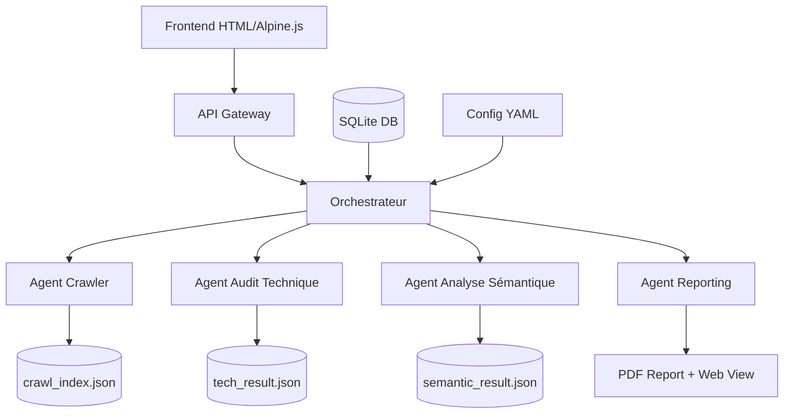

# Architecture Fire Salamander

## Vue d'ensemble

## Technologies

### Backend
- **Langage** : Go (simplicité, performance, concurrence native)
- **Base de données** : SQLite (démarrage simple, migration PostgreSQL possible)
- **Configuration** : YAML centralisée

### Frontend
- **Templates** : Go templates HTML natifs (dans `templates/`)
- **CSS** : Classes utilitaires custom + couleurs SEPTEO
- **JavaScript** : Alpine.js (léger, réactif)
- **Assets** : Font Awesome, Google Fonts

### Templates existants
Le projet utilise les templates dans `templates/` :
- `home.html` - Page d'accueil avec formulaire d'analyse
- `analyzing.html` - Page de progression de l'audit
- `results.html` - Affichage des résultats

## Structure des agents

### Agent Crawler
- **Responsabilité** : Explorer le site, respecter robots.txt
- **Entrée** : URL seed + paramètres de crawl
- **Sortie** : `crawl_index.json`

### Agent Audit Technique  
- **Responsabilité** : Lighthouse + règles SEO
- **Entrée** : `crawl_index.json`
- **Sortie** : `tech_result.json`

### Agent Analyse Sémantique
- **Responsabilité** : Extraction keywords + IA optionnelle
- **Entrée** : `crawl_index.json`
- **Sortie** : `semantic_result.json`

### Agent Reporting
- **Responsabilité** : Fusion des résultats + génération PDF
- **Entrée** : Tous les résultats JSON
- **Sortie** : Rapport final

## Configuration

La configuration est centralisée dans `config/` :
- `config.yaml` - Configuration principale (existante)
- `crawler.yaml` - Paramètres de crawl
- `semantic.yaml` - Moteur sémantique
- `tech_rules.yaml` - Règles d'audit technique

## Contrats API

Tous les contrats sont définis en JSON Schema dans `SPECS/technical/api-contracts/` :
- `audit_request.schema.json`
- `crawl_result.schema.json` 
- `tech_result.schema.json`
- `semantic_result.schema.json`

## Flux de données

1. **Initialisation** : Utilisateur soumet URL via `home.html`
2. **Orchestration** : L'orchestrateur lance les agents en séquence
3. **Crawl** : Collecte des pages selon `crawler.yaml`
4. **Audit** : Analyse technique et sémantique en parallèle
5. **Reporting** : Fusion et génération du rapport final
6. **Affichage** : Résultats via `results.html`

## Sécurité

- Toutes les URLs externes utilisent HTTPS + SRI
- Pas de hardcoding (validation par hooks git)
- Sandboxing des audits Lighthouse
- Anonymisation des prompts IA