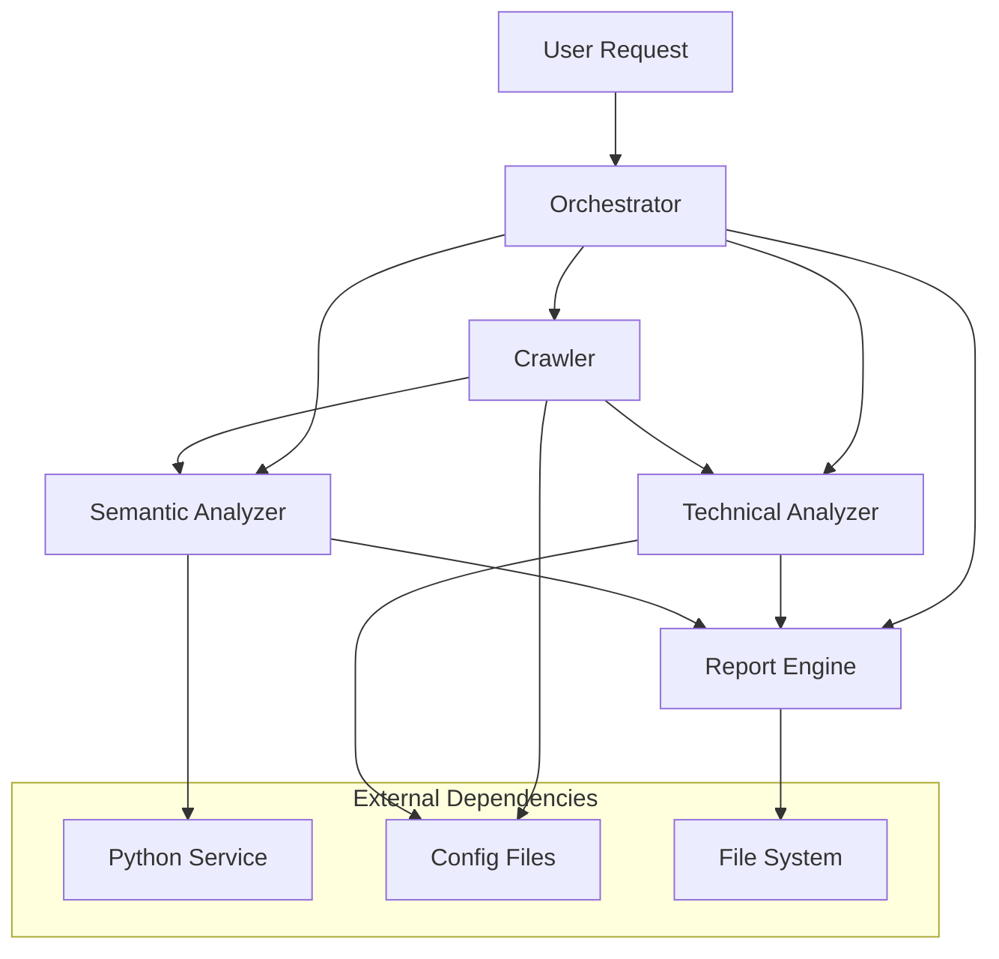

# Matrice de Dépendances - Fire Salamander

## Vue d'ensemble des dépendances



## Matrice détaillée

| Agent | Dépend de | Input Format | Output Format | Bloque | Timeout | Fallback |
|-------|-----------|--------------|---------------|---------|---------|----------|
| **Orchestrator** | User input | HTTP Request | audit_id | Tous | 10s | ❌ |
| **Crawler** | Orchestrator + Config | audit_request.json | crawl_index.json | Technical, Semantic | 5min | Partial results |
| **Technical** | Crawler + Tech Rules | crawl_index.json | tech_result.json | Report | 10min | Basic validation |
| **Semantic** | Crawler + Python | crawl_index.json | semantic_result.json | Report | 5min | Regex keywords |
| **Report** | Tech + Semantic | *_result.json | final_report.html | User | 30s | JSON fallback |

## Dépendances critiques

### 🔴 Bloquantes (Pipeline s'arrête)
1. **Config Files Missing**
   - `config/crawler.yaml` - Pipeline ne peut pas démarrer
   - `config/tech_rules.yaml` - Analyse technique impossible
   - Fallback: Configuration par défaut hardcodée

2. **Orchestrator Failure**
   - Crash de l'orchestrator = tout s'arrête
   - Pas de fallback possible
   - Nécessite restart complet

### 🟠 Critiques (Impacts majeurs)
1. **Crawler Timeout**
   - Impact: Pas de données → analyses impossibles
   - Fallback: Analyse de l'URL seed uniquement
   - Timeout: 5 minutes configurable

2. **Technical Rules Invalid**
   - Impact: Pas de validation SEO
   - Fallback: Règles par défaut minimales
   - Validation: Au démarrage du service

### 🟡 Importantes (Dégradation gracieuse)
1. **Python Semantic Service Down**
   - Impact: Pas d'analyse ML/NLP
   - Fallback: Extraction regex simple
   - Detection: Health check HTTP

2. **Report Template Error**
   - Impact: Pas de rapport HTML
   - Fallback: Export JSON brut
   - Alternative: Template minimal

## Séquences de démarrage

### 1. Cold Start (Premier lancement)
```
1. Load Config Files (10s)
2. Initialize Crawler (2s)
3. Initialize Technical Analyzer (1s)
4. Start Python Semantic Service (15s)
5. Initialize Report Engine (1s)
6. Health Check All Agents (5s)
Total: ~34s
```

### 2. Warm Start (Service running)
```
1. Validate Config (1s)
2. Health Check Agents (2s)
3. Ready for audits
Total: ~3s
```

### 3. Recovery Start (After failure)
```
1. Detect failed components (5s)
2. Restart failed services (10-30s)
3. Restore partial state (5s)
4. Resume pending audits (variable)
Total: 20s-60s
```

## Points de défaillance

### Crawler Dependencies
```yaml
Required:
- config/crawler.yaml ✅
- Internet connectivity ⚠️
- Target site availability ⚠️

Optional:
- robots.txt (peut être ignoré)
- sitemap.xml (améliore efficacité)
```

### Technical Analyzer Dependencies
```yaml
Required:
- config/tech_rules.yaml ✅
- Crawl data (JSON) ✅

Optional:
- Lighthouse API (performance scoring)
- External validators (HTML/CSS)
```

### Semantic Analyzer Dependencies
```yaml
Required:
- Python service (Flask) ⚠️
- French language model ⚠️
- Crawl data (text content) ✅

Critical:
- Memory: 2GB+ pour CamemBERT
- Disk: 500MB+ modèles ML
```

### Report Engine Dependencies
```yaml
Required:
- Template files ✅
- Analysis results (JSON) ✅
- Output directory permissions ✅

Optional:
- SEPTEO logo file (base64 fallback)
- Custom CSS themes
```

## Stratégies de recovery

### 1. Graceful Degradation
```go
// Priority order for partial failures
priorities := []string{
    "crawler",     // Essential - sans crawl, pas d'audit
    "technical",   // Core - validation SEO de base
    "report",      // Required - output pour l'utilisateur
    "semantic",    // Nice-to-have - peut être skippé
}
```

### 2. Retry Policies
```yaml
Crawler:
  max_retries: 3
  retry_delay: 2s
  exponential_backoff: true
  timeout_per_page: 30s

Technical:
  max_retries: 1
  retry_delay: 1s
  fallback_to_basic: true

Semantic:
  max_retries: 2
  retry_delay: 5s
  fallback_to_regex: true
  health_check_interval: 30s

Report:
  max_retries: 1
  fallback_to_json: true
  template_validation: startup
```

### 3. Circuit Breaker Pattern
```go
type CircuitBreaker struct {
    FailureThreshold  int           // 5 échecs
    RecoveryTimeout   time.Duration // 60s
    HalfOpenRequests  int           // 3 tentatives
}

States: CLOSED → OPEN → HALF_OPEN → CLOSED
```

## Monitoring et métriques

### Health Checks
```json
{
  "services": {
    "crawler": {"status": "healthy", "last_check": "2025-09-02T14:30:00Z"},
    "technical": {"status": "healthy", "last_check": "2025-09-02T14:30:00Z"},
    "semantic": {"status": "degraded", "last_check": "2025-09-02T14:29:45Z", "error": "High latency"},
    "report": {"status": "healthy", "last_check": "2025-09-02T14:30:00Z"}
  },
  "overall": "degraded",
  "audit_capacity": "80%"
}
```

### Dependency Metrics
- Crawler success rate: 95%+
- Technical analysis coverage: 100%
- Semantic availability: 90%+
- Report generation success: 99%+
- End-to-end success rate: 85%+

## Tests de dépendances

### Integration Tests Matrix
```go
func TestDependencyMatrix(t *testing.T) {
    scenarios := []struct{
        name string
        disabled []string  // Services to disable
        expected string    // Expected final status
    }{
        {"All OK", []string{}, "completed"},
        {"Semantic Down", []string{"semantic"}, "partial"},
        {"Crawler Timeout", []string{"crawler"}, "failed"},
        {"Technical + Semantic Down", []string{"technical", "semantic"}, "minimal"},
    }
}
```

## Livrables Sprint 1.5

### INT-005: Matrice complète
- ✅ Diagramme de dépendances Mermaid
- ✅ Matrice détaillée avec timeouts
- ✅ Points de défaillance identifiés
- ✅ Stratégies de recovery définies
- ✅ Health checks spécifiés
- ✅ Métriques de monitoring
- ✅ Tests de dépendances planifiés