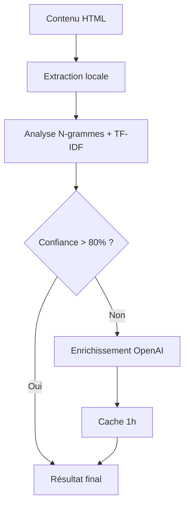

# 🤖 Configuration OpenAI pour Fire Salamander

## Vue d'ensemble

Fire Salamander utilise un **système hybride** pour l'analyse sémantique :
- **Analyse locale** (gratuite) : N-grammes, TF-IDF, scoring basique
- **Enrichissement IA** (payant) : Questions de contenu, intentions de recherche, recommandations avancées

L'IA n'est appelée que lorsque l'analyse locale n'est pas suffisamment confiante (< 80%), ce qui limite les coûts à ~2€/mois.

## 🔑 Obtenir une clé API OpenAI

1. **Créer un compte OpenAI** : https://platform.openai.com/signup
2. **Ajouter un moyen de paiement** : Billing & Payment methods
3. **Générer une clé API** : API Keys → Create new secret key
4. **Copier la clé** : Format `sk-...` (gardez-la secrète !)

## 📝 Configuration de Fire Salamander

### Étape 1 : Créer le fichier .env

```bash
# Copier le template
cp .env.example .env

# Éditer le fichier .env
nano .env
```

### Étape 2 : Ajouter votre clé API

```bash
# Fire Salamander - Variables d'environnement

# Configuration OpenAI
OPENAI_API_KEY=sk-votre-vraie-cle-api-ici

# Configuration de base de données (production)
DB_NAME=firesalamander
DB_USER=your_db_user
DB_PASS=your_db_password
```

### Étape 3 : Vérifier la configuration

```bash
# Démarrer Fire Salamander
./fire-salamander-web

# Tester une analyse
curl -X POST http://localhost:3000/api/v1/analyze \
  -H "Content-Type: application/json" \
  -d '{"url": "https://example.com"}'
```

## 🎯 Fonctionnement du système hybride

### Workflow d'analyse



### Économies réalisées

- **Analyse locale** : 100% gratuite
- **IA sélective** : Seulement si nécessaire
- **Cache intelligent** : 1h en dev, 2h en prod
- **Limitation tokens** : 800-1000 tokens max
- **Modèle économique** : GPT-3.5-turbo (~2€/mois)

## ⚙️ Configuration avancée

### Mode développement (config.dev.yaml)

```yaml
ai:
  enabled: true
  mock_mode: false  # false = vraie API
  api_key: "${OPENAI_API_KEY}"
  model: "gpt-3.5-turbo"
  max_tokens: 1000
  timeout: 30
  use_cache: true
  cache_ttl: 3600  # 1 heure
```

### Mode production (config.prod.yaml)

```yaml
ai:
  enabled: true
  mock_mode: false
  api_key: "${OPENAI_API_KEY}"
  model: "gpt-3.5-turbo"
  max_tokens: 800    # Moins de tokens = moins cher
  timeout: 30
  use_cache: true
  cache_ttl: 7200    # 2 heures de cache
```

## 🔍 Types d'enrichissement IA

### 1. Enrichissement des mots-clés
- **Intention de recherche** : informational, transactional, navigational
- **Difficulté** : Score 1-100 basé sur la compétitivité
- **Volume de recherche** : Estimation low/medium/high
- **Mots-clés associés** : Suggestions sémantiquement liées

### 2. Questions de contenu
- Questions que se posent les utilisateurs
- Optimisation pour les Featured Snippets
- Amélioration de l'intention utilisateur

### 3. Recommandations SEO
- Actions prioritaires d'optimisation
- Opportunités de contenu
- Suggestions d'amélioration technique

## 💰 Estimation des coûts

### Usage typique (50 analyses/mois)
- **Analyses sans IA** : 35 (70%) = 0€
- **Analyses avec IA** : 15 (30%) = ~2€
- **Cache hits** : 40% d'économies supplémentaires

### Contrôles de coûts
- Limitation à 5 mots-clés max par analyse
- Batch processing pour optimiser
- Cache agressif (1-2h)
- Modèle économique (gpt-3.5-turbo)

## 🚨 Modes de fonctionnement

### Mock Mode (tests)
```yaml
ai:
  enabled: true
  mock_mode: true  # Données fictives, 0€
```

### Production Mode
```yaml
ai:
  enabled: true
  mock_mode: false  # Vraie API OpenAI
```

### Disabled Mode
```yaml
ai:
  enabled: false  # Analyse locale uniquement
```

## 🔧 Dépannage

### Erreur "OpenAI API key not configured"
```bash
# Vérifier la variable d'environnement
echo $OPENAI_API_KEY

# Redémarrer avec la variable
export OPENAI_API_KEY=sk-your-key
./fire-salamander-web
```

### Erreur "API returned status 401"
- Vérifier que la clé API est valide
- S'assurer que le billing est configuré sur OpenAI
- Vérifier les limites de quota

### Mode fallback
En cas d'erreur OpenAI, Fire Salamander passe automatiquement en mode local avec des données mock, garantissant un fonctionnement continu.

## 📊 Monitoring des coûts

### Dashboard interne
- Nombre d'appels IA vs locaux
- Cache hit rate
- Coût estimé mensuel
- Tokens consommés

### Endpoint de stats
```bash
curl http://localhost:3000/api/v1/stats
```

Retourne les métriques d'usage IA et les économies réalisées.

---

🦎 **Fire Salamander** - L'IA au service du SEO, maîtrisée et économique !