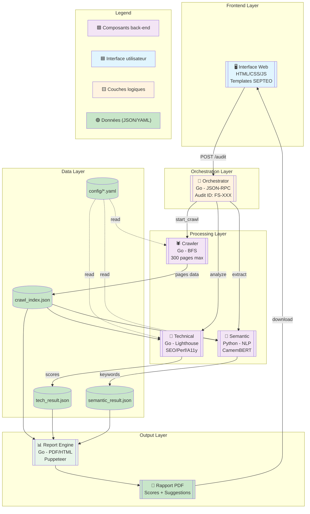

# Architecture Fire Salamander

## Vue d'ensemble

Fire Salamander est un système d'audit SEO automatisé développé pour SEPTEO Digital Services, conçu pour remplacer les solutions payantes comme Screaming Frog.

## Schéma du système



## Description des composants

### Frontend Layer (🟦 Interface utilisateur)

**Interface Web** : Application web utilisant les templates SEPTEO
- Technologies : HTML5, CSS3, JavaScript vanilla
- Responsabilités :
  - Saisie de l'URL à auditer
  - Affichage de la progression
  - Téléchargement du rapport

### Orchestration Layer (🟨 Couches logiques)

**Orchestrator** : Service de coordination central
- Technologies : Go, JSON-RPC 2.0
- Responsabilités :
  - Génération des audit_id (format FS-XXX)
  - Coordination des agents
  - Gestion des états d'audit
  - Communication asynchrone

### Processing Layer (🟪 Composants back-end)

#### Crawler Agent
- **Technologie** : Go
- **Algorithme** : BFS (Breadth-First Search)
- **Limites** :
  - Max 300 pages
  - Profondeur max : 3
  - Timeout : 5 minutes
- **Respect** : robots.txt, sitemap.xml

#### Technical Analyzer
- **Technologie** : Go + Google Lighthouse
- **Analyses** :
  - SEO : meta tags, headings, structure
  - Performance : Core Web Vitals
  - Accessibilité : WCAG 2.1
  - Best Practices : HTTPS, console errors

#### Semantic Analyzer
- **Technologie** : Python
- **ML/NLP** :
  - Modèle : CamemBERT/DistilCamemBERT
  - Extraction : N-grammes (2-5 mots)
  - Clustering : HDBSCAN
  - Ranking : XGBoost

### Data Layer (🟢 Données)

- **Formats** : JSON pour les données, YAML pour la configuration
- **Stockage** : Système de fichiers local
- **Structure** : `/audits/{audit_id}/`
- **Rétention** : 30 jours

### Output Layer

**Report Engine** : Génération de rapports
- Technologies : Go + Puppeteer/wkhtmltopdf
- Formats : PDF et HTML
- Contenu :
  - Executive summary
  - Scores techniques
  - Suggestions sémantiques
  - Recommandations priorisées

## Flux de données

1. **Initiation** : L'utilisateur entre une URL via l'interface web
2. **Orchestration** : L'orchestrator génère un audit_id unique
3. **Crawling** : Le crawler explore le site en respectant les contraintes
4. **Analyse parallèle** : Technical et Semantic analysent les données
5. **Agrégation** : Les résultats JSON sont consolidés
6. **Rapport** : Generation du PDF avec tous les insights
7. **Livraison** : Le rapport est disponible au téléchargement

## Communication inter-agents

**Protocole** : JSON-RPC 2.0

**Exemple de message** :
```json
{
  "jsonrpc": "2.0",
  "method": "start_crawl",
  "params": {
    "audit_id": "FS-001",
    "seed_url": "https://example.fr",
    "max_urls": 300
  },
  "id": "orch-001"
}
```

## Métriques de performance

| Composant | Métrique | Cible |
|-----------|----------|-------|
| Crawler | Pages/seconde | > 2 |
| Technical | Analyse/page | < 2s |
| Semantic | Traitement total | < 60s |
| Report | Génération PDF | < 30s |
| **Total** | **Audit complet** | **< 5 min** |

## Technologies et dépendances

### Backend (Go)
- **Version** : Go 1.21+
- **Frameworks** :
  - Gorilla Mux (routing)
  - Colly (crawling)
  - Testify (tests)
- **Intégrations** :
  - Google Lighthouse API
  - Puppeteer (via subprocess)

### ML/NLP (Python)
- **Version** : Python 3.9+
- **Frameworks** :
  - Flask (API REST)
  - Transformers (HuggingFace)
  - scikit-learn (clustering)
- **Modèles** :
  - CamemBERT-base (production)
  - DistilCamemBERT (mode rapide)

### Configuration
- **Crawler** : `config/crawler.yaml`
- **Technical** : `config/tech_rules.yaml`
- **Semantic** : `config/semantic.yaml`
- **Stopwords** : `config/stopwords_fr.txt`

## Gestion des erreurs

### Stratégies de fallback
1. **Crawler fails** → Rapport "Site inaccessible"
2. **Technical fails** → Analyse basique (titre/meta)
3. **Semantic fails** → Keywords par regex simple
4. **Report fails** → Export JSON brut

### Circuit breaker
- Seuil d'échec : 5 erreurs consécutives
- Temps de recovery : 60 secondes
- Mode dégradé : Service partiel maintenu

## Sécurité

### Mesures implémentées
- Rate limiting : 2 req/s par défaut
- Validation d'entrée : URL whitelist
- Timeout stricts : Prévention DoS
- Sandboxing : Isolation des analyses

### RGPD et conformité
- Pas de stockage de données personnelles
- Rétention limitée (30 jours)
- Logs anonymisés
- Droit à l'effacement

## Évolutions futures

### Phase 2 - Fonctionnalités avancées
- Support multi-langues (EN, ES, IT)
- Analyse concurrentielle
- Tracking historique des changements
- API publique documentée

### Phase 3 - Intelligence artificielle
- Suggestions de contenu par GPT
- Prédiction de trafic
- Détection d'anomalies
- Recommandations personnalisées